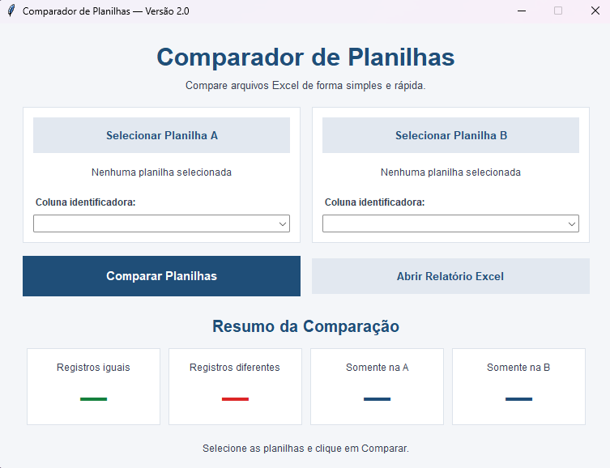

# Comparador de Planilhas

Aplicação desenvolvida em **Python** para automatizar a comparação de duas planilhas Excel, identificando registros iguais, diferentes e exclusivos de cada arquivo.

O projeto surgiu da ideia de facilitar tarefas de conferência de dados que normalmente são realizadas manualmente, como verificar informações de vendas, pedidos e cadastros armazenadas em planilhas diferentes.

## Funcionalidades

- Seleção de duas planilhas Excel (`.xlsx`) por meio de uma interface gráfica.
- Escolha da coluna identificadora de cada planilha.
- Comparação de arquivos que utilizam nomes diferentes para seus identificadores, como `Pedido` e `Código`.
- Identificação de registros iguais, diferentes e exclusivos de cada planilha.
- Comparação dos campos em comum entre os arquivos.
- Identificação de alterações em textos e diferenças numéricas.
- Geração de relatório Excel com os resultados.
- Validação de identificadores vazios ou duplicados.

## Interface do aplicativo

A versão 2.0 conta com uma interface gráfica que permite selecionar os arquivos, definir as colunas identificadoras e visualizar um resumo da comparação.



## Como funciona

1. O usuário seleciona as duas planilhas Excel.
2. Escolhe a coluna que identifica os registros em cada arquivo.
3. O sistema encontra os registros correspondentes utilizando os identificadores selecionados.
4. Os campos em comum são comparados para identificar possíveis alterações.
5. O aplicativo apresenta um resumo e gera um relatório Excel com os resultados.

Por exemplo, uma planilha pode utilizar a coluna `Pedido` e outra utilizar `Código`. Mesmo com nomes diferentes, o sistema consegue relacionar os registros quando seus identificadores correspondem.

## Relatório de comparação

Após a execução, o aplicativo gera o arquivo `relatorio_comparacao.xlsx`, organizado em quatro abas:

| Aba | Descrição |
|---|---|
| Resumo | Quantidade de registros iguais, diferentes e exclusivos |
| Diferenças | Campos que apresentam valores diferentes entre as planilhas |
| Só na A | Registros presentes apenas na primeira planilha |
| Só na B | Registros presentes apenas na segunda planilha |

O relatório permite consultar tanto as quantidades gerais quanto os registros que precisam ser conferidos.

## Tecnologias utilizadas

- **Python:** lógica de comparação e processamento.
- **Pandas:** leitura e análise dos dados das planilhas.
- **OpenPyXL:** geração e formatação dos relatórios Excel.
- **Tkinter:** desenvolvimento da interface gráfica.
- **PyInstaller:** criação do executável Windows.

## Como executar

### Opção 1 — Aplicativo Windows

O projeto possui uma versão executável (`.exe`) que permite utilizar a interface sem instalar Python.

O executável da versão 2.0 será disponibilizado na seção **Releases** deste repositório.

### Opção 2 — Executar pelo código-fonte

É necessário ter o Python instalado.

Primeiro, instale as dependências:

```bash
python -m pip install pandas openpyxl
```

Depois, execute a interface gráfica:

```bash
python interface.py
```

Na janela do aplicativo, selecione as duas planilhas, escolha os identificadores e execute a comparação.

## Testes automatizados

Foram desenvolvidos testes para verificar a comparação dos registros, a identificação de diferenças e a geração do relatório.

**Teste de integração:**

```bash
python testar_integracao.py
```

**Teste das funcionalidades da versão 2.0:**

```bash
python testar_v2.py
```

O segundo teste verifica especificamente a comparação entre planilhas com colunas identificadoras de nomes diferentes.

## Evolução do projeto

### Versão 1.0
- Comparação de duas planilhas utilizando a coluna `ID`.
- Identificação de registros iguais, diferentes e exclusivos.
- Geração de relatório Excel.

### Versão 2.0
- Interface gráfica para seleção de arquivos.
- Seleção independente das colunas identificadoras.
- Suporte a identificadores com nomes diferentes.
- Aplicativo executável para Windows.
- Testes automatizados para validar o funcionamento.

## Objetivo do projeto

Desenvolver uma solução prática de automação para reduzir o trabalho manual de comparação de dados, aplicando conhecimentos de Python, manipulação de planilhas, validação de informações e desenvolvimento de interfaces.

O projeto também faz parte do meu aprendizado e desenvolvimento de experiência prática em programação.
